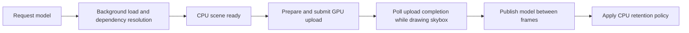

# Minimal asset streaming plan

Implemented on 2026-09-12. This extends the current asset system and renderer with three behaviors: a skybox-only first frame, model insertion after background loading and GPU upload, and CPU data release configured by asset type. The sections below retain the implementation design; usage is documented in [the asset API](../zenith-asset/README.md#streaming-and-cpu-retention).

The streaming unit is a complete model and its required dependencies. Keep the current cache format, codecs, Rayon workers, dependency transactions, checked downcasts, and GPU submission machinery. No new dependency or scheduler is needed.

## Existing support and required changes

| Requirement | Already available | Smallest addition |
|---|---|---|
| Skybox-only startup | Empty `WorldRenderer::scenes`; the lighting shader samples the skybox where cleared depth is zero | Load the skybox first and defer the model request until after the first frame |
| Add a loaded model while rendering | `load`, `queue_scene`, `UploadTicket::poll`, and `complete_pending` | Use the queued path in the application and expose per-entry readiness/failure |
| Release CPU data by asset type | Typed slots, snapshots, and separate GPU resources | Retention policy, payload-independent revision metadata, and upload-completion acknowledgements |

The first two features are primarily application integration. CPU release is the main asset-system change: the current handle owns the CPU value, and both revision discovery and GPU cache lookup currently require that value to exist.

## 1. Boot with the skybox

Change `zenith-sandbox/examples/world.rs`:

1. Request only the skybox during `prepare`.
2. Construct `WorldRenderer` while the skybox loads, preserving the existing overlap.
3. Wait for and upload that required skybox through `set_skybox`, then return from `prepare`.
4. Render the first frame with zero scene entries.
5. On the following application tick, start the demo model request and call `queue_scene`. Later application actions can enqueue additional models through the same path.

A flag set after the first successful `WorldApp::render` call and consumed on the next tick is sufficient for the demo. No engine lifecycle callback or asset-priority queue is necessary. Removing the model request from `prepare` also prevents the single asset coordinator from processing the model ahead of the skybox.

Keep the common renderer pipelines, render targets, and skybox/IBL resources. Only the skybox content asset is required for the initial scene; model geometry, materials, and their textures are absent. The skybox remains a complete cached texture, including its existing mip chain.

Move the example's one-time camera bounds calculation out of blocking startup. Inspect the model's CPU snapshots when ready, before GPU completion releases them, and discard those temporary snapshots after framing the camera. Keep the skybox camera usable while loading.

## 2. Queue models and publish them when GPU-ready

Reuse the current sequence:



The application retains the returned scene index. Add a small `scene_status(index)` query describing waiting, uploading, ready, or failed. GPU readiness comes from the committed renderer entry, independently of whether its CPU payload is resident.

Keep the existing single pending upload batch. A new model becomes visible as a complete prepared scene after its ticket succeeds. Existing models and the skybox continue rendering while a request or upload is pending. CPU `Handle::Ready` alone is insufficient to show a model; its GPU upload must also be complete.

Handle recoverable model preparation/load errors per entry, preserve the previous GPU scene if one exists, and report the error once. Record the failed attempt so the same invalid revision is not retried every frame. A new revision or explicit retry can resume it. Device/submission failures that prevent rendering remain renderer errors. A failed optional model must not make a healthy skybox-only scene exit.

## 3. Configure CPU retention by Rust asset type

Add one policy enum and one builder method:

```rust
pub enum CpuRetention {
    Keep,
    ReleaseAfterUpload,
}

let assets = AssetServer::builder()
    .with_builtin_assets()
    .cpu_retention::<Mesh>(CpuRetention::ReleaseAfterUpload)
    .cpu_retention::<Texture>(CpuRetention::ReleaseAfterUpload)
    .cpu_retention::<Scene>(CpuRetention::Keep)
    .cpu_retention::<Material>(CpuRetention::Keep)
    .build()?;
```

The sketch omits the existing source/cache configuration. `Keep` is the default for every type, preserving existing callers. The streaming example selects release for meshes and textures, which contain the large CPU buffers. Scene and material descriptions stay available by default in that example, but users can configure them and custom asset types the same way.

Store policies by Rust `TypeId` and copy the selected policy into each typed slot. Avoid a built-in-type switch. A custom uploader acknowledges consumption through the same generic handle API as the renderer. The asset crate remains independent of Vulkan and does not track global GPU residency: residency belongs to each renderer/device.

The type policy also applies to generated values. Releasing a source-less generated asset preserves its existing GPU representation, but recreating it on a later GPU cache miss requires application regeneration. Such types should use `Keep` when that recovery is needed.

## 4. Retain slot metadata when CPU payloads are released

Extend `Slot<T>::State` so the last published revision exists independently of `Option<AssetSnapshot<T>>`. Keep the content stamp, address, dependency-slot references, and last error when releasing the payload.

Add `Handle::revision() -> Option<Revision>` and a `LoadState::CpuReleased { revision }` state. Their meanings are:

| Operation/state | Meaning after CPU release |
|---|---|
| `id`, `path`, `revision` | Still identify the same asset and content revision |
| `get`, `snapshot` | Return `None` until CPU data is restored |
| `state` | Reports CPU release, rather than perpetual loading |
| `wait` | Waits for an active attempt; otherwise returns a specific CPU-released error |
| Existing GPU scene | Remains drawable through its own GPU references |
| Existing application `Arc<T>` / snapshot | Remains valid and keeps its allocation alive |

Use the stored revision when publishing. If the content stamp is unchanged but the CPU value is absent, repopulate the CPU value with the same revision. Actual content/dependency changes advance the revision as before. The current `publish` implementation would otherwise leave an unchanged, released value absent, because it replaces values only when the stamp changes.

Separate checks for CPU residency from checks for a previously published asset. In particular, watcher refresh must not reload a CPU-released asset merely because `value` is absent. Source changes and explicit reloads still work. Retaining dependency-slot metadata preserves ancestor invalidation even when scene or material CPU values are released.

CPU release means removing the slot's owning reference. Physical deallocation occurs when the last snapshot/`Arc` owner releases the value; it cannot invalidate another component's reference. Keep small identity/dependency metadata and the GPU resources needed for drawing.

## 5. Release the exact consumed snapshot after successful upload

Add a generic operation such as `Handle::release_cpu(&snapshot)`. It respects the slot's configured policy and verifies both the content revision and `Arc` identity of the current payload against the consumed snapshot. Identity matters because restoring the same content can create a new CPU allocation without changing its content revision.

During GPU preparation, collect acknowledgements for the snapshots actually consumed. Store them with the existing `UploadTicket`/`Pending` batch, deduplicated by asset identity and consumed snapshot. A short type-erased completion callback can capture the typed handle and snapshot; this keeps the implementation generic and retains normal checked downcasts.

After upload completion:

1. Confirm the ticket succeeded and publish its prepared GPU scene/skybox.
2. Run the acknowledgements, releasing eligible CPU slot values.
3. Drop the ticket's snapshots and completed staging ownership.

Failure or cancellation drops the pending acknowledgements without releasing the slots. An old upload completion cannot evict a newer revision or a newly restored CPU allocation. A GPU cache hit can acknowledge a resident snapshot once the consuming scene is committed, since that exact content revision already has a completed GPU representation.

For scene/material policies, acknowledgement means their information has been copied into the committed renderer representation: transforms and draw instances for scenes, scalar parameters and texture bindings for materials. Acknowledge each consumed dependency according to its own type policy. Avoid recursively releasing every dependency indiscriminately; an unused dependency or another subsystem's data may not have been consumed.

Apply release under the existing publication/slot synchronization, and drop retired payloads after those locks are released, matching the current publication discipline. Never release a vector by mutating an asset behind outstanding `Arc<T>` references.

## 6. Reuse GPU assets without requiring CPU data

In `GpuAssets::mesh` and `texture`, use `handle.id()` plus the payload-independent revision to check the GPU cache first. Acquire/validate the CPU snapshot only on a GPU cache miss. `WorldRenderer` revision polling must also use metadata rather than requiring `snapshot()`.

Apply the same rule to `prepare_skybox`: a cached GPU image supplies its cubemap metadata, while a GPU cache miss needs the CPU texture. Restore the skybox texture through its own handle when necessary.

Preflight a scene before starting an upload batch. CPU scene/material data is needed to construct a new GPU scene; mesh/texture CPU payloads are needed only for GPU cache misses. Hold the existing publication read guard while selecting a coherent set of revisions and snapshots.

For restoration, add an additive `WorldRenderer::with_asset_server(&assets)` binding used by the streaming application. It stores a cheap server clone and allows the renderer to reuse the existing nonblocking `AssetServer::reload(&scene_handle)` when a required CPU payload is absent. A full root reload restores its dependency graph even if the root scene itself was retained. This avoids a new request kind, scheduler, or queue reference in every handle.

Request restoration once, leave the entry pending, and continue rendering until it completes. Preflight before allocating GPU upload resources so missing CPU data does not repeatedly create partial upload batches. With unchanged content, restored slots keep their revision and existing GPU cache entries remain reusable. A new renderer/device cache can upload from the restored data.

The configured server must own handles used for automatic restoration; report a mismatched server or a non-reconstructible generated value clearly. Existing renderer construction and APIs continue working with default `Keep` retention. Applications can also explicitly call the existing `load`/`reload` APIs to request CPU data and retain a snapshot for their own use.

## 7. Release staging memory as well

The current `GpuAssets::recycle` retains up to **128 MiB** of upload buffers. Dropping `Texture::pixels` and mesh vectors alone would leave that host-visible staging allocation pool resident.

Replace the hard-coded limit with a configurable staging-cache byte budget. Preserve 128 MiB as the compatibility default, and configure **zero** in the streaming example so completed batches release their staging buffers. Users who prefer reuse can select a nonzero budget. In-flight buffers remain owned by the ticket/submission until GPU completion.

This is a renderer-wide staging budget because one staging buffer can contain several asset types. It is separate from the per-type CPU payload policy. Keep the GPU geometry, textures, and descriptor bindings required to draw the scene.

## Implementation order and touched files

| Step | Main files | Result |
|---|---|---|
| 1. Skybox-first application flow | `zenith-sandbox/examples/world.rs` | A rendered frame before any model request |
| 2. Queued model status and recoverable failure handling | `zenith-renderer/src/world.rs` | Runtime model insertion using existing upload polling |
| 3. Type policies and persistent slot metadata | `zenith-asset/src/handle.rs`, `server.rs`, `error.rs`, `lib.rs` | CPU release/restoration with stable identity and revision |
| 4. Completion acknowledgements and CPU-independent GPU lookup | `zenith-renderer/src/gpu_assets.rs`, `world.rs` | Type-specific payload release after successful GPU preparation |
| 5. Restoration preflight and staging budget | Same renderer files and the world example | Shared/new-model loads remain functional after release; staging is reclaimed |
| 6. Focused tests and API documentation | Asset/renderer tests, README, validation script | Verified streaming behavior and documented ownership |

No changes to glTF/HDR importers, the v2 on-disk format, or RHI submission primitives are required. Existing synchronous helpers remain available.

## Acceptance tests

- Hold the model source behind a bounded test gate. Render skybox-only frames successfully while the model is blocked, with zero model uploads. Release the gate and verify the model appears only after its upload completes.
- Load a second model while the first remains visible; verify shared geometry/textures still deduplicate uploads.
- Verify `Keep` retains CPU values and `ReleaseAfterUpload` releases consumed mesh/texture values after GPU completion. Cover configurable scene/material and custom-type acknowledgement as well.
- Use weak CPU-value references to verify actual ownership release after test snapshots are dropped. An externally held snapshot must remain valid until its owner drops it.
- Confirm GPU readback/rendered output remains correct after CPU data is released, and completed staging ownership is dropped with a zero cache budget.
- Verify unchanged watcher polls do not restore evicted CPU values, unchanged-content restoration preserves revision, and source changes still propagate through released dependency slots.
- Finish an old upload after a newer revision or same-revision CPU restoration; its acknowledgement must not release the new allocation.
- Inject an optional-model failure or upload-preparation failure; preserve the skybox/last good model and CPU recovery data, and avoid a per-frame retry loop.
- Exercise a GPU cache miss after CPU release, including a second renderer, and ensure restoration is queued once and succeeds without a render-thread wait.
- Run the existing CPU/feature-matrix tests and Vulkan asset tests with both retention policies. Keep tests based on synchronization and ownership, not wall-clock speed thresholds.

This supplies whole-model streaming. Upload preparation still copies a complete model's new buffers on the render thread, so a very large model can cause a preparation-frame hitch. Per-frame byte budgets, partial mip streaming, distance-based residency, model removal, GPU eviction, and device-loss recreation are later extensions; they are not needed for this minimum feature set.

## Verification on 2026-09-12

- Workspace/all-target tests passed. Asset runtime tests passed with default features disabled, both with and without `parallel`; all-feature workspace checking and the five asset documentation examples passed.
- All four ignored renderer tests passed with Vulkan synchronization validation. They cover gated model loading with skybox rendering, insertion after upload, both metadata retention policies, GPU deduplication, model/skybox restoration in a second renderer, optional model failures and retries, failed reload preservation, and resumed content revisions.
- Ownership checks verified that consumed CPU allocations disappear after external snapshots drop, stale upload acknowledgements preserve both newer revisions and restored allocations, cancellation retains CPU payloads, and a zero staging budget releases completed staging allocations.
- The real cached debug world run completed 1,000 frames with exit code 0 and no Vulkan validation errors. Startup counters were one CPU decode, zero meshes, and one uploaded texture. The model request followed the skybox-only first frame; completion reported seven total decodes, one mesh, and four uploaded textures. Logs: `target/streaming-world-errors.log`.
- Strict asset Clippy passed. Renderer Clippy passed with the pre-existing `too_many_arguments` lint in `lighting.rs` excluded; that unrelated function was unchanged.

The validation script already runs the complete ignored renderer test suite, so the new streaming tests require no script changes.
