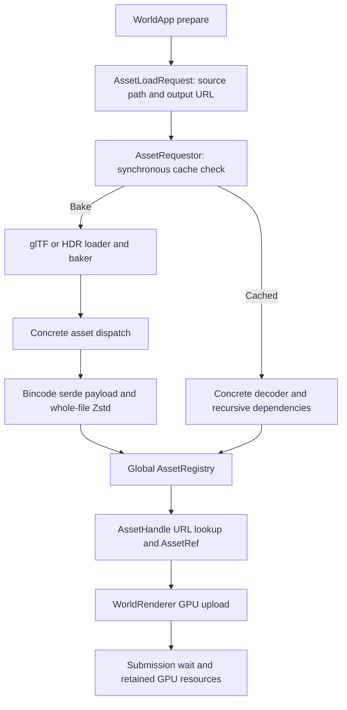
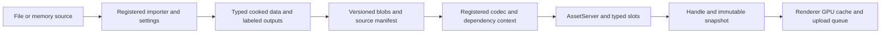

**Asset system assessment and proposed optimization plan — 2026-09-12**

Implementation and validation: [asset-system-implementation.md](asset-system-implementation.md). This document records the pre-migration assessment and proposal.

The recommended direction is an owned `AssetServer` with typed handles, registered importers, explicit dependencies, and a versioned artifact cache. Optimize extension boundaries first, caller ergonomics second, and measured execution costs third. Keep the initial implementation synchronous; its data model should support background loading without another API redesign.

This is a design proposal, not an implementation. It covers all seven asset source modules, engine initialization, the world example, renderer uploads, filesystem resolution, and the separate shader path. Source observations refer to the working tree, including concurrent dependency cleanup. Proposed APIs below do not exist yet.

The final review check, `cargo test -p zenith-asset --offline` using Rust 1.97.1, passed: one unit test and both documentation tests passed; the full source-import test was ignored. Concurrent dependency cleanup repaired the earlier documentation failures and added the serde cache-layout test. That passing check covers the observed snapshot, not subsequent edits. No renderer run or performance benchmark was performed for this assessment.

The current data flow is:



| Area | Current behavior | Consequence |
|---|---|---|
| Runtime storage | A global `OnceLock<AssetRegistry>` holds a locked map of `(AssetUrl, TypeId)` to `Arc<dyn Asset>`. | Typed retrieval exists, but storage lifetime and initialization are process-wide. Creating another registry does not redirect handle lookup to it. |
| Identity | `AssetUrl` wraps an unchecked `PathBuf`; its extension determines a closed `AssetType`. Assets also carry their own URL. | Identity, disk layout, and type are coupled. Unknown or empty extensions can panic, including lookup through a null handle. |
| Caller API | Callers specify both source and baked paths, load synchronously, then construct a handle separately. | The caller must understand output naming and initialization order. The load operation does not return its typed result. |
| References and ownership | Handles contain a URL and `PhantomData`, with no ownership of loaded data. `AssetRef` owns an `Arc` but imposes a phantom borrow lifetime. | The global registry retains data; dropping handles does not unload it. Reads take the global lock, clone a path, and downcast during dereference. |
| Import extension | `RawAssetType`, extension matching, and manager switches recognize glTF and HDR. `Png` exists in the enum without a top-level load route. | Adding a format requires manager edits. Image decoding inside glTF supports more formats than standalone asset requests. |
| Asset extension | Mesh, texture, material, and scene each appear in serialization and cache-loading dispatch. | Implementing `Asset` alone is insufficient. `Mesh<V>` is generic, but the manager's baked mesh route selects the default vertex type. |
| Dependencies | Cache loading manually traverses scene → mesh → material → textures. Fresh baking emits and registers its whole output bundle. | The two paths differ. Cache loading has no shared dependency mechanism, deduplication check, in-flight request table, or cycle detection. |
| Persistence | Each asset is serialized with Bincode's serde API and compressed with Zstd. A magic value and fixed GUID prefix identify the format. | No per-artifact schema, importer/settings fingerprint, dependency manifest, bounded decoded size, or transactional bundle commit. |
| Freshness | Root source mtime is compared with the requested output; one `.cache_version` represents the entire cache. | External glTF images/buffers are omitted. Missing dependent artifacts are not used to trigger rebaking. |
| CPU/GPU boundary | The renderer creates separate GPU resources. The CPU texture format nevertheless includes an `ash::vk::Format` conversion. | Preserve separate resource lifetimes, while moving backend conversion into the renderer. |
| GPU reuse | `add_scene` deduplicates textures within one call, uploads meshes, then waits. Skybox upload also waits. | Repeated scene additions can duplicate GPU assets; there is no persistent asset revision cache. Frame rendering already uses retained GPU resources, so CPU handle lookup is not currently a per-draw bottleneck. |
| Shaders | `Gpu::compile_shader` invokes Slang separately and includes device descriptor strides in compilation. | Shader integration would need a distinct target-sensitive build key. An asset rewrite must not silently replace this behavior. |

The main implementation references are [registry, handles and serialization](E:/MyProjects/zenith/zenith-asset/src/lib.rs), [request and cache management](E:/MyProjects/zenith/zenith-asset/src/manager.rs), [glTF import](E:/MyProjects/zenith/zenith-asset/src/gltf.rs), [HDR import](E:/MyProjects/zenith/zenith-asset/src/hdr.rs), [asset data types](E:/MyProjects/zenith/zenith-asset/src/mesh.rs), [world integration](E:/MyProjects/zenith/zenith-renderer/src/world.rs), [texture upload](E:/MyProjects/zenith/zenith-renderer/src/helpers.rs), and [shader compilation](E:/MyProjects/zenith/zenith-rhi/src/shader.rs).

Several correctness issues should become acceptance cases for the redesign. These are code-level findings; they were not all reproduced through application execution.

| Finding | Concrete trigger and effect | Required behavior |
|---|---|---|
| Global cache version can hide stale assets | After a version change, rebaking asset A writes the current global version even though asset B still has an old payload. A missing version file is also treated as clean. | Validate each build/artifact independently. |
| Dependencies do not invalidate builds | Editing `scene.bin` or a referenced PNG without editing `scene.gltf` leaves the root mtime check satisfied. A missing `.tex` instead fails recursive loading. | Record every source input and output, then rebuild the owning source bundle when required. |
| Partial results can escape | Baking writes and registers assets one at a time. Failure midway leaves a partially updated cache and registry. Concurrent requests can write the same files. | Stage outputs, validate the bundle, and commit through one manifest; deduplicate work. |
| Safe extension code can violate unsafe lookup | `AssetRef::deref` uses `unwrap_unchecked()` on a result from implementer-controlled `as_any()`. A safe implementation returning a different value breaks its assumption. | Use checked standard-library downcasts and compiler-derived `Send`/`Sync`. |
| Paths do not enforce the stated root | Absolute paths and parent components can enter `AssetUrl` and be joined to configured directories. Source paths are also unchecked. | Validate logical paths and enforce source containment, including filesystem links where relevant. |
| glTF output identifiers collide | Every root node starts `process_node` with `base_idx = 0`; recursive numbering is based on local output counts. Multiple mesh-bearing roots can overwrite the same `stem_0.mesh`. | Label geometry by document mesh/primitive identity, independent of traversal. |
| glTF scene semantics are flattened | Every scene is traversed into one mesh list; node transforms and instances are discarded. | Preserve scene selection and nodes/instances referencing shared geometry. |
| Geometry fallback is incomplete | Flat normals are generated from consecutive positions before indices are read; non-indexed primitives are rejected; primitive topology is not handled explicitly. | Respect indices/topology, split vertices when generating flat normals, and provide deterministic handling or errors for unsupported modes. |
| Material defaults are incorrect | An omitted material resolves to material index zero when available. The renderer skips meshes that have no material. | Use the glTF default material and a renderer fallback. |
| Texture semantics are collapsed | One texture is emitted per image. Normal usage takes precedence over color and data usage; glTF textures default to one mip. Some 16-bit data paths preserve integer bytes while mapping their formats to Vulkan SFLOAT. | Use explicit transfer functions/channel semantics, usage-specific variants, valid numeric conversions, and deliberate mip policies. |

The existing Cerberus fixture has one scene, six nodes, one mesh, one material, three images, and one external buffer. It provides little coverage for multi-root geometry, shared materials, multiple scenes, or format variants. The HDR is 4096 × 2048; the baker chooses 2048-square cube faces. Its retained RGB32F face mip chains alone occupy approximately 384 MiB, calculated from dimensions and storage layout. That is an allocation-size estimate, not a measured process peak.

The architecture should establish these boundaries:



Start with modules inside `zenith-asset`: `path`, `server`, `handle`, `source`, `import`, `cache`, and `types`. Put GPU preparation and Vulkan conversion in `zenith-renderer`. A separate import crate or command-line cooker becomes useful when a packaged runtime needs to exclude glTF, image decoding, ISPC, and Rayon; it is not required to prove the architecture.

**1. Make registration the extension mechanism.**

Keep runtime assets as owned Rust values with `Any + Send + Sync` bounds. Remove the requirement that every asset knows its path or extension. Add an optional persistence contract for assets that can be cooked. Procedurally created values should still work through `assets.add(value)` without implementing serialization.

An illustrative persistence contract is:

```rust
pub trait Asset: Any + Send + Sync {}

impl<T: Any + Send + Sync> Asset for T {}

pub trait CookedAsset: Asset + Sized {
    type Data: Serialize + DeserializeOwned + Send + Sync + 'static;

    const TYPE_KEY: &'static str;
    const SCHEMA_VERSION: u32;

    fn from_data(data: Self::Data, ctx: &mut LoadContext) -> Result<Self, AssetError>;
}
```

`register_asset::<T>()` installs the default serde codec, schema metadata, and conversion callback. A custom codec is an explicit override for specialized payloads. A leaf asset can use `Data = Self`; a material uses serializable `MaterialData` with typed asset paths and constructs runtime `Material` with typed dependency handles. This avoids pretending that ordinary serde deserialization can reconstruct runtime handles without a resolver.

An importer has associated `Settings` and `Output: CookedAsset`, an importer key/version, supported extensions, and an instance method taking the source and `ImportContext`. It returns root `Output::Data`. `ctx.emit::<T>(label, data)` adds other typed outputs and returns `AssetPath<T>`. `ctx.read_relative(path)` records the bytes of every external input. Format-specific intermediate types such as `RawGltf` remain private implementation details; the manager does not need a `RawAssetType` enum or a universal raw-data trait.

Use generics and associated types in extension implementations. Convert them to a private, dyn-compatible adapter or function table at registration. Do not attempt to store the associated-constant persistence trait directly as `dyn CookedAsset`. Resolve importer ambiguity explicitly by extension, expected root type, and optional importer selection; report duplicate type keys, duplicate labels, and conflicting registrations during setup/import.

The acceptance criterion is concrete: a downstream crate can add a new CPU asset and importer by implementing the contracts and registering them, with zero edits to manager, cache, dependency traversal, or built-in enums. A plugin here means a linked Rust extension; runtime-loaded native libraries are a separate ABI problem.

**2. Separate logical identity, runtime ownership, and build identity.**

| Concept | Proposed representation and role |
|---|---|
| Logical address | A validated source-relative path plus optional sub-asset label, for example `mesh/cerberus/scene.gltf#meshes/0/primitives/0`. The path includes its source namespace. |
| Typed persisted reference | `AssetPath<T>` stores that logical address. Its serialization does not contain a runtime pointer or slot number. |
| Runtime identity | A server-scoped ID identifies one live slot. `TypeId` is an internal dispatch/checking key only. |
| Handle | `Handle<T>` owns an `Arc` to its typed slot. Cloning has no `T: Clone` requirement. `Option<Handle<T>>` expresses absence. |
| Value snapshot | `get()` returns `Option<Arc<T>>`. Renderer-facing `snapshot()` returns the value and revision together, captured under one lock. |
| Artifact identity | A stable digest identifies a cooked build/output, including the effective settings and target profile. Distinct variants cannot overwrite each other. |

Persist an explicit namespaced type key such as `zenith.texture`, plus schema version. Rust documents that `TypeId` hashes/order and layout are not stable across compiler releases; it also highlights variance hazards for type-identity wrappers. Use invariant phantom markers for typed IDs/paths when enforcing exact type identity. [Rust TypeId documentation](https://doc.rust-lang.org/std/any/struct.TypeId.html)

Normalize logical separators and reject absolute/root-escaping paths. Define case behavior explicitly; do not lowercase arbitrary filenames. `FileSource` owns filesystem resolution and containment, so a shipped application is independent of the compile-time workspace location. Start with file and in-memory sources. The interface leaves room for packs or remote sources without implementing them now.

Document that path-and-label identity survives reload, but not arbitrary source renames or reordered glTF indices. Stable editor GUIDs and a rename catalog are a later extension if editing workflows require them. Do not use a mutable content hash as the sole logical identity.

**3. Make ownership and loading behavior explicit.**

An engine/application owns its `AssetServer`; handles hold typed slots rather than consulting a singleton. Start with `Arc<Slot<T>>` and a short `RwLock` around each slot's status/value. Keep only weak slot references in the deduplication index. Live handles, dependency handles, active jobs, and any explicit residency cache pin resources. Prune expired index entries. Dropping the server shuts down jobs while already acquired snapshots remain valid.

A handle follows the latest successfully published value. A snapshot keeps the exact old value alive. Hot reload replaces the slot's immutable `Arc<T>` and increments its revision; it does not mutate a value already in use. Application-controlled interior mutation is outside this revision contract.

Initial load moves through `Loading` to `Ready` or `Failed`. A reload keeps the last successful value usable, records a failed attempt separately, and emits a reload error without replacing good data. `load_blocking` succeeds only after required dependencies are ready; nonblocking `load` returns a handle after request validation and exposes completion/failure through status and events. No file I/O occurs in handle dereference or `get()`.

Checked `Arc<dyn Any + Send + Sync>::downcast` is sufficient at the erased boundary. Typed slots remove the need to downcast on every value dereference. Trait upcasting is already stable on the installed toolchain and can eliminate the current repeated `as_any()` methods during migration. [Arc downcasting](https://doc.rust-lang.org/std/sync/struct.Arc.html#method.downcast), [Rust 1.86 trait upcasting](https://blog.rust-lang.org/2025/04/03/Rust-1.86.0/)

A generational arena is an alternative if slot allocation/handle size later proves significant. It introduces a separate liveness policy and stale-ID handling; the Arc-slot approach is the simpler initial fit for the stated priorities.

**4. Treat dependencies and multi-output imports as core behavior.**

Distinguish build inputs from runtime dependencies. External PNGs and `.bin` files determine when glTF must be rebuilt. Runtime material-to-texture references determine readiness and retention. If a processor consumes another cooked value, record that build dependency and its digest as well.

`LoadContext::dependency<T>(AssetPath<T>)` returns a typed handle and records an edge automatically. Persist runtime dependency metadata with each artifact so cache-only loads use the same graph as fresh imports. Verify the edges reported by decoding agree with the stored metadata. Central scheduling deduplicates a diamond dependency graph and propagates errors with the complete dependency chain.

Reject cycles in required loading/build dependencies with a readable cycle path. Check the whole in-flight dependency graph, not only one recursive call stack. Future optional back-references can use explicit weak/soft links that do not participate in readiness or strong ownership. Never hold the registry lock while invoking an importer, codec, dependency resolver, or filesystem operation.

For glTF, emit labels from document mesh/primitive, material, image/usage, and scene identities. Import geometry once; store node transforms and mesh/material instances in `Scene`. The root resolves to the document default scene, with a documented fallback to scene zero, while other scenes have explicit labels. Shared images can emit separate color, normal, and linear-data variants. The settings digest distinguishes compression, mip, coordinate-conversion, and target choices.

This follows the useful pattern of a load context collecting labeled assets and tracking dependencies, which Bevy exposes publicly; Zenith can adopt the pattern without depending on its ECS or reflection infrastructure. [Bevy LoadContext source](https://docs.rs/bevy_asset/latest/src/bevy_asset/loader.rs.html)

**5. Give each cooked build a verifiable cache contract.**

Use a manifest per source/settings/target build. Record the source and all external input digests, importer key/version, canonical effective settings, target profile, output labels, stable output type keys, schema/codec versions, runtime dependencies, sizes, and output digests. Include any consumed cooked dependencies in the build key. TypeId, randomized Rust hashes, and mtimes are unsuitable persisted build identifiers. Mtime can accelerate discovery; actual content digests establish freshness.

Store an explicit container version, type key, schema version, codec/compression identifier, decoded length, and payload integrity information. Validate size limits before allocating or decompressing and validate decoded meshes/textures before GPU preparation. Require the decoder to consume the complete payload. Unknown versions/formats and metadata failures produce structured errors, not panics or an implicit clean-cache decision.

Retain Bincode's serde encoding and Zstd initially, behind the codec/container boundary. Concurrent dependency work is already removing redundant derives and narrowing features; that cleanup should preserve existing payload compatibility. Introduce new manifests and schemas as a distinct versioned cache generation. Preserve the old generation during migration; use explicit legacy readers/aliases or rebake from source. A packaged build with no sources must contain compatible artifacts or fail clearly.

Write new blobs to immutable build-specific locations, validate the full output set, then publish a manifest as the commit point. Use a platform-correct atomic manifest replacement on Windows and Unix; `flush()` alone and replacing individual sibling files do not constitute a transaction. Serialize competing writers for one build, including separate cooker processes if they share a cache. Abandoned unreferenced blobs can be collected later. Readers continue using the previous valid manifest after a failed import or interrupted write.

Use the same codecs and dependency logic for fresh and cached loads. In development, a bad/missing artifact rebuilds its owning source when available. In packaged mode, the manifest resolves logical source addresses without consulting the original source tree; invalid artifacts are actionable errors. Keep a clear distinction between publishing a valid artifact bundle and taking a consistent runtime snapshot: multiple independent handle reads can span revisions. The renderer should stage related updates and publish a consistent prepared scene at a frame boundary.

**6. Reduce the common API to loading a path and keeping a handle.**

An intended application call site is:

```rust
let assets = AssetServer::builder()
    .source(FileSource::new("content"))
    .cache_dir("asset")
    .with_builtin_assets()
    .build()?;

let scene = assets.load_blocking::<Scene>("mesh/cerberus/scene.gltf")?;
let skybox = assets.load_blocking::<Texture>("texture/minedump_flats_4k.hdr")?;

renderer.add_scene(gpu, descriptors, &scene)?;
renderer.set_skybox(gpu, descriptors, &skybox)?;
```

The built-in registration helper installs scene/mesh/material/texture codecs and glTF/HDR importers. Applications adding a format call `.register_importer(MyImporter::default())`; a new cooked type also needs `.register_asset::<MyType>()`. Required arguments use constructors, optional import settings use ordinary configuration structs with `Default`, and exceptional customization uses the builder.

`load_with` accepts typed importer settings for overrides; the effective settings are always part of the request/cache key. The common `load` path uses declared defaults. `assets.add(value)` returns a handle for generated content. A generated value acquires a persistent address only through an explicit save/import operation.

Use a structured `AssetError` for invalid paths, unsupported/ambiguous importers, wrong asset type, missing labels/dependencies, cycles, invalid data, incompatible cache, and I/O. Include source path, importer and dependency chain, while retaining the original error as its cause. `anyhow` can continue to add context at application boundaries. Compile the public examples as documentation tests.

**7. Add background loading after the contracts work synchronously.**

Put blocking filesystem work and CPU import/compression jobs on bounded workers. Use one in-flight operation per canonical request key, and a separate source-bundle key so requesting several glTF labels imports the file once. Schedule dependency continuations without blocking worker threads waiting for jobs queued to that same pool. Completion events carry identity, revision and errors; the renderer consumes them at frame boundaries.

Keep `load_blocking` as a convenience adapter over the same state machine. Add nonblocking `load`, explicit reload, and file watching once deduplication and error propagation are correct. On shutdown, stop accepting work and join active jobs. A caller abandoning a shared request must not cancel work still needed by another caller or dependency.

Native async functions in traits are available, but methods returning opaque futures are not directly dyn-compatible. If asynchronous sources are later necessary, expose typed futures on the implementation side and box futures only inside the erased adapter, with explicit `Send` bounds for worker execution. The present file/CPU pipeline does not require Tokio, a new executor abstraction, or async methods in every public trait. [Rust dyn-compatibility rules](https://doc.rust-lang.org/reference/items/traits.html#dyn-compatibility)

**8. Optimize the costs that remain measurable.**

| Order | Change | Measurement or acceptance gate |
|---|---|---|
| First | Deduplicate loaded and in-flight assets/dependencies. | A shared material/texture is decoded once per requested revision, including concurrent requests and diamond graphs. Reusing a live handle performs no disk reads. |
| First | Keep a persistent renderer cache per GPU/device, keyed by runtime asset identity and revision. Reuse geometry across instances and textures across scene additions. | Adding the same scene twice creates instances without duplicate geometry/texture uploads. Device teardown releases its cache. CPU residency remains a separate choice. |
| Next | Stream decompression from a file/buffered reader and reduce full-buffer copies. | Compare cold/warm cache load latency, bytes copied and peak memory. Small material/scene metadata can continue using ordinary reads. |
| Next | Compress/release HDR face mip data incrementally; cap import concurrency by memory cost. Parallelize independent glTF images within the same budget. | Measure HDR peak resident memory, bake time, and output equivalence. Do not retain every RGB32F face/mip merely to compress it later. |
| Next | Add semantic texture settings: linear/sRGB, numeric type, normal processing, mip policy, compression quality, cube resolution and target formats. | Verify color/normal/data reuse, 16-bit inputs, odd dimensions and 1×1/2×2 BC mip tails. Maintain intended image quality. |
| Later | Batch uploads through a reusable staging allocation and publish GPU assets when their submission completes. Retain the previous revision until its last GPU use completes. | No main-thread upload waits during streaming; upload bytes/frame and frame-time percentiles stay within an explicit budget. Reuse existing RHI submission/resource-lifetime machinery. |
| Later | Choose compression per payload; consider independently addressable texture mip/mesh chunks. | Benchmark Zstd against uncompressed BC payloads and representative meshes. Adopt chunking only with an actual partial-loading consumer. |
| Only if justified | Generational arenas, lock-free slot reads, specialized borrowed/archived formats, packfiles, or mesh layout generalization. | Profiling must demonstrate allocation, lock, decode or file-open costs that simpler changes do not address. |

Move `TextureFormat::to_vk()` to renderer conversion code and make numeric/transfer semantics explicit in CPU data. Keep runtime vertex types extensible through typed registration and distinct schema keys per cooked layout. Do not build a universal dynamic vertex schema until a second concrete layout needs it. Scene instances should own material assignments/transforms separately from shared geometry.

The shader path is a later integration candidate. Any shader build key must include entry point, stage, source/import contents, compiler/version/options, target capabilities, debug mode and both descriptor heap strides. Preserve `Gpu::compile_shader` and current import-refresh behavior during the asset migration. Generic asset caching must not reuse SPIR-V across incompatible device compilation parameters.

The implementation should proceed in reviewable stages:

| Stage | Scope | Done when |
|---|---|---|
| 0 — Establish behavior | After concurrent dependency edits settle, retain passing documentation/cache-layout checks and add asset-only regression fixtures for dependency invalidation, duplicate output names, corrupt caches, and required glTF fallbacks. Capture bake/cache/upload counters and separate timings. | CPU tests run without Vulkan or Slang. Existing Cerberus/HDR behavior is recorded and the known failures have executable cases. |
| 1 — Open the core | Owned server, checked typed slots/handles, validated paths, type/codec/importer registration; keep synchronous loading and adapt the existing world example. | A downstream custom asset/importer and a generated in-memory asset work without core dispatch edits. Two servers have independent roots/state. Wrong types and invalid handles cannot reach unchecked downcasts. |
| 2 — Make dependencies/cache reliable | Multi-output bundles, labeled references, build inputs, typed runtime dependencies, per-build manifests, versioned artifacts, transactional publication and load deduplication. | Editing only a PNG or buffer rebuilds the right bundle; changing settings creates the right variant; missing/corrupt outputs recover in development; interrupted writes leave the old bundle usable. Fresh and cached loads expose equivalent assets. |
| 3 — Correct built-in data semantics | Preserve glTF scenes/nodes/instances, handle material/geometry fallbacks, distinguish texture usage variants and numeric formats, move Vulkan conversion to renderer. | Multi-root/multi-scene/shared-mesh fixtures retain distinct identities and transforms; default materials render; texture semantic and small-mip tests pass. Version changed schemas explicitly. |
| 4 — Add background work and reload | Bounded scheduling, graph-wide in-flight deduplication, status/events, last-good reload behavior, and a persistent renderer asset cache. | Concurrent loads produce one build/decode; cycles return errors; failed reloads keep old content usable; GPU revisions are swapped and retired safely. |
| 5 — Package and tune | A cooker/runtime separation where useful; chunking, compression, staging, and memory improvements selected from measurements. | Packaged runtime loads from a relocated directory without source files or compile-time workspace paths. Performance improvements are recorded against stage-0 measurements with equivalent output quality. |

Stages 1 and 2 deliver the main architectural value. Stage 3 is required before broadening glTF support. Stages 4 and 5 can follow actual streaming and shipping requirements. Do not combine a new asset architecture, new serialization format, new scheduler, and new rendering upload model into one change.

The performance baseline should separate cold bake, cached startup, reuse of already resident assets, dependency graph resolution, and GPU upload. Record wall time, peak memory, source/artifact bytes, import/decode/upload counts, and allocation counts; for streaming, also record frame-time percentiles. Retain the existing world example timing categories but add these counters. No numeric speedup is claimed by this plan.

Useful acceptance fixtures are a custom non-render asset, a custom vertex layout, two server roots, a procedural mesh, a diamond dependency graph, a dependency cycle, two mesh-bearing root nodes, shared geometry with different transforms/materials, non-indexed geometry, omitted material/normals, one image used as both normal and color, external-source-only changes, importer/settings changes, malformed artifact lengths, truncated compression, and a failed multi-output write. Run GPU validation only for format/upload/lifetime changes; most asset tests should stay CPU-only.

The intended result is a small core in which adding an asset type means defining its data/conversion and registering it, adding a source format means writing one importer, and application code loads a path into a typed handle. Dependency processing, cache validity, ownership and GPU preparation then have explicit places to evolve.
